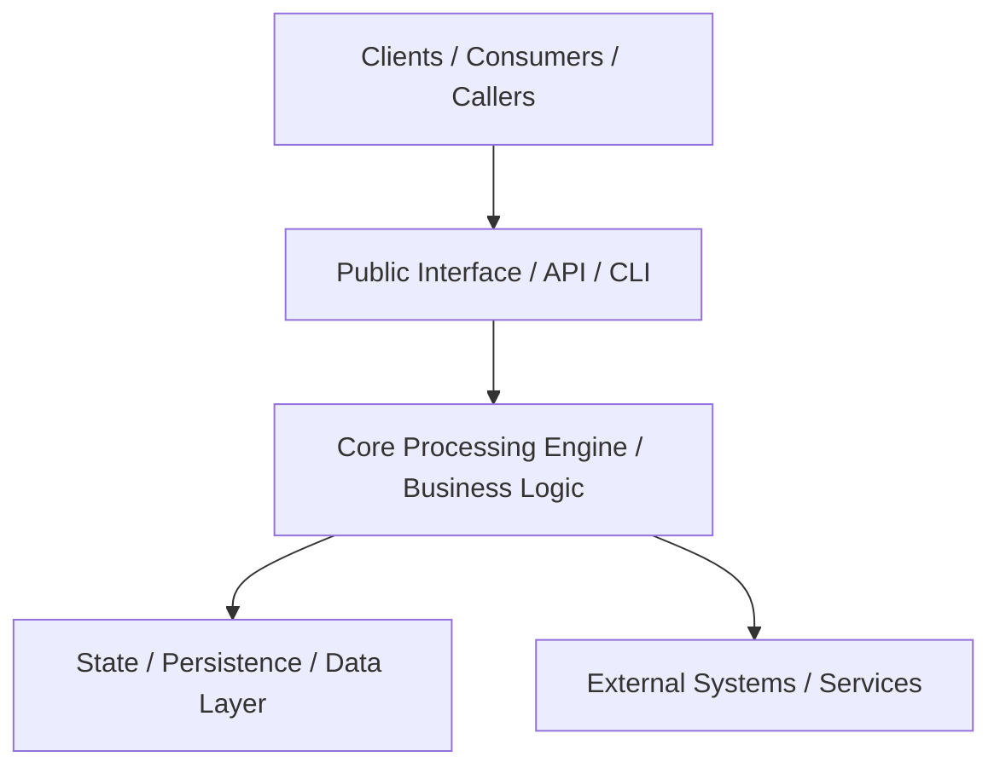

# System Architecture — {{PROJECT_NAME}}

## High-Level Overview

{{PROJECT_DESCRIPTION}}

## Core Architectural Principles

1. **Explicit Boundaries**: Each component has a single, well-defined responsibility.
2. **Deterministic State**: State transitions must be predictable and verifiable.
3. **Traceability & Observability**: Critical operations log structured diagnostic events or telemetry.
4. **Graceful Degradation**: External failures (I/O, network, dependencies) fail safely with informative diagnostics.
5. **Contract Stability**: Public interfaces and data formats must maintain backward compatibility.

## Security & Trust Boundaries

- **Input Validation**: All incoming external data must be validated and sanitized before domain processing.
- **Access Control & Permissions**: Clear trust boundaries between caller permissions and execution privileges.
- **Secret Isolation**: Configuration and credentials must remain externalized and never committed to source.
