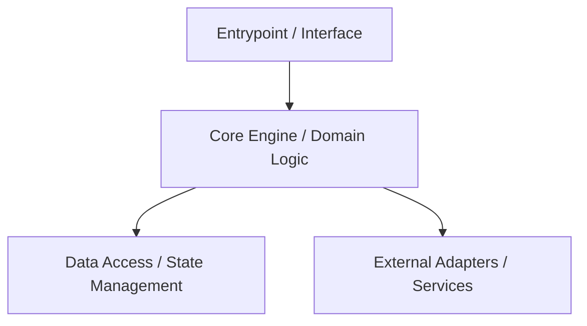

# Project Modules & Subsystems — {{PROJECT_NAME}}

This document details the internal modules, subsystems, or packages that compose {{PROJECT_NAME}}.

## High-Level Subsystem Map



## Directory Organization

```text
{{PATH_SRC}}
├── core/            # Core business domain logic and primary algorithms
├── interfaces/      # Public API, CLI commands, or external interfaces
├── adapters/        # Integrations with filesystem, network, or external systems
└── utils/           # Shared, stateless helper utilities
```

## Subsystem Specifications

### 1. Core Domain (`core/`)
- **Responsibility**: Houses primary business rules, calculations, and domain entities.
- **Contracts**: Framework-agnostic pure logic.
- **Invariants**: Must not depend on transport layers or external I/O directly.

### 2. Interfaces (`interfaces/`)
- **Responsibility**: Translates incoming requests or commands into domain operations.
- **Contracts**: Validates inputs, handles serialization/deserialization, and returns structured outputs.
- **Invariants**: Thin layer; contains no domain business logic.

### 3. Adapters & Storage (`adapters/`)
- **Responsibility**: Manages persistence, external service communication, or hardware interaction.
- **Contracts**: Implements domain-defined repository or client interfaces.
- **Invariants**: Handles network or storage failures gracefully; enforces timeouts and retries.

## Cross-Module Rules

1. **Unidirectional Dependencies**: High-level modules must not depend on low-level implementation details.
2. **Explicit Interfaces**: All inter-module communication must use defined interfaces or public functions.
3. **Isolation**: Avoid global mutable state across module boundaries.
