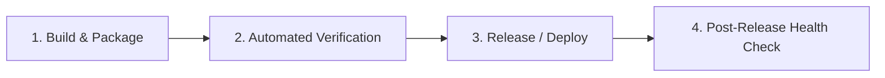

# Operations & Release Guide — {{PROJECT_NAME}}

This document details release, execution, deployment, and operational procedures for {{PROJECT_NAME}}.

## Release & Execution Pipeline



## Pre-Release Checklist

1. [ ] Ensure working tree is clean and on the target release branch or tag.
2. [ ] Verify all test suites and static checks pass cleanly (`{{CMD_CHECK}}`, `{{CMD_TEST}}`).
3. [ ] Confirm build / packaging artifacts succeed (`{{CMD_BUILD}}`).
4. [ ] Verify `CHANGELOG.md` reflects all unreleased changes under a version heading.
5. [ ] Backup persistent state or configuration if performing stateful updates.

## Release Procedure

1. **Tag or Snapshot**:
   Create a release tag or commit baseline:
   ```bash
   git tag -a vX.Y.Z -m "Release vX.Y.Z"
   ```

2. **Build Release Artifacts**:
   ```bash
   {{CMD_BUILD}}
   ```

3. **Deploy / Publish**:
   Execute the project publication or execution command:
   ```bash
   {{CMD_RUN}}
   ```

4. **Post-Release Verification**:
   - Verify process status and health checks.
   - Inspect logs for unexpected errors or exceptions.

## Rollback Procedure

If a critical fault is discovered post-release:
1. Revert to previous release artifact or commit tag:
   ```bash
   git checkout <previous-stable-tag>
   ```
2. Re-run build and verify operational status.
3. If database or data migration was applied, execute backwards migration or restore snapshot.
