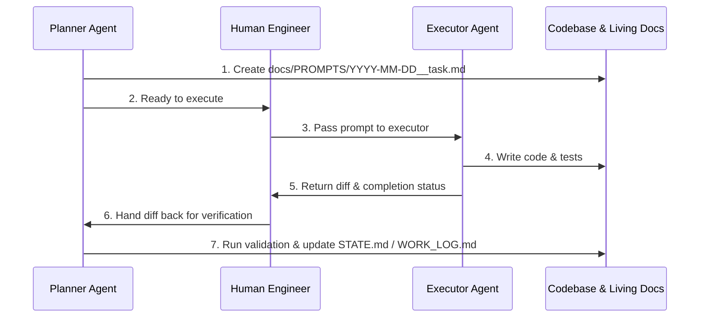

# Prompts Archive & Task-Driver Mode

This directory contains structured task prompts created during planning sessions and handed over to executor agents or subagent workers.

## Naming Convention

```text
YYYY-MM-DD__<short-slug>.md
```
Example: `2026-09-08__core-parser-refactor.md`

## Why Task-Driver Mode?

When collaborating across sessions or delegating implementation:
1. **Separation of Concerns**: The Planner analyzes architecture, invariants, and constraints without burning context on code generation.
2. **Explicit Verification**: The prompt defines an exact acceptance checklist and out-of-scope boundaries.
3. **Audit Trail**: Every prompt remains documented in repository history, explaining *why* and *how* changes were made.

## Workflow



## Template

Use `docs/PROMPTS/TEMPLATE__task-prompt.md` to create new prompts.
