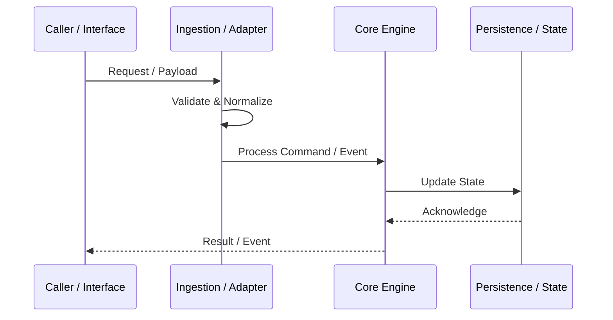

# Feature & Integration Specification Template — <Feature Name>

Use this template for major architectural additions, external integrations, or complex subsystems before implementation.

---

# <Feature Name> Specification

## 1. Executive Summary
<Brief description of what this feature accomplishes, why it is needed, and its expected impact.>

## 2. System Context & Architecture
<Diagram and explanation of where this feature sits within the system topology.>

## 3. Data Models & Schemas
- **Input / Staging Data**: Structure of incoming payloads or arguments.
- **Domain Mapping**: How incoming data maps to internal state models.
- **Persistence & Audit**: Preserving state or event history.

## 4. Interfaces & Contracts
- Entrypoint or signature: `function_or_endpoint(params)`
- Input validation and precondition checks.
- Return values, error codes, and exception types.

## 5. Failure Modes & Edge Cases
- Network/storage timeouts or disconnects.
- Duplicate payloads (idempotency handling).
- Malformed inputs, missing fields, or out-of-order execution.

## 6. Verification & Test Plan
- Unit test strategy for domain logic.
- Mocking or simulating external adapters/services.
- Acceptance criteria and verification commands.
